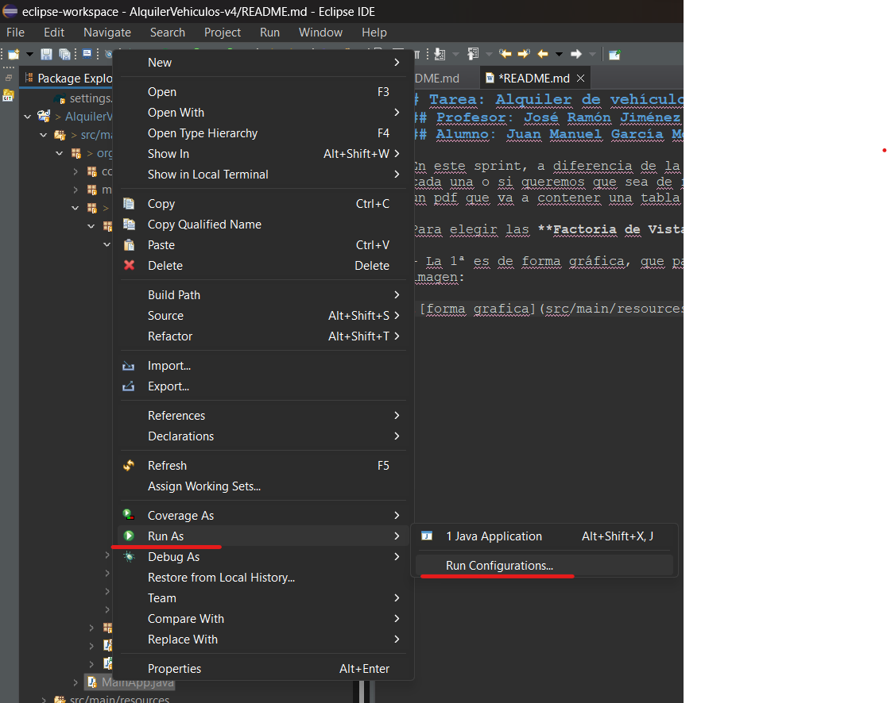
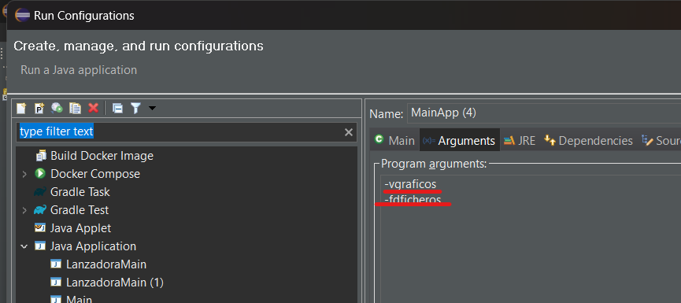
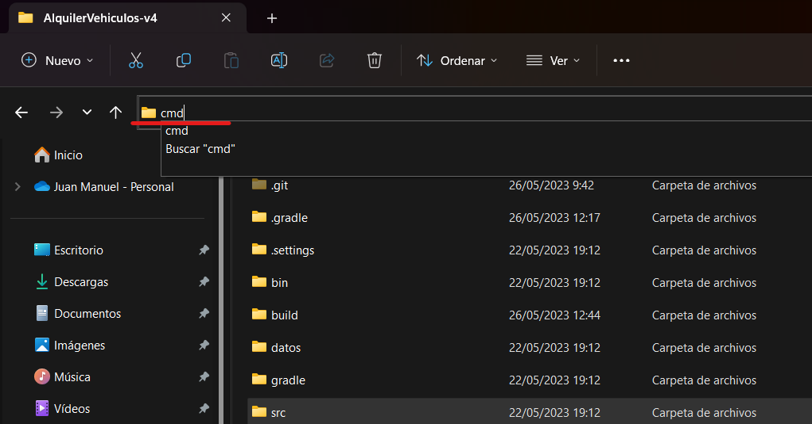
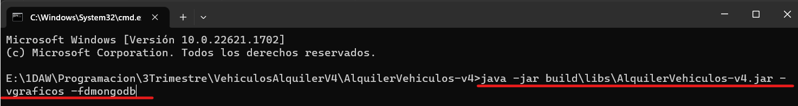
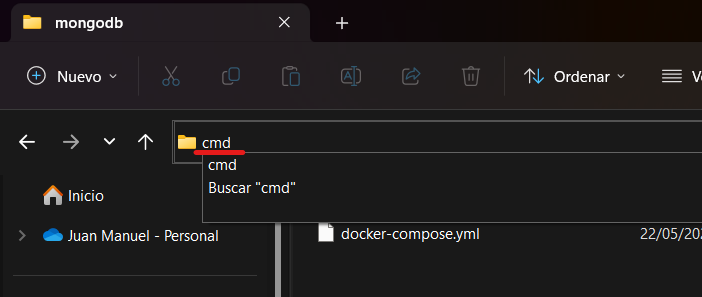
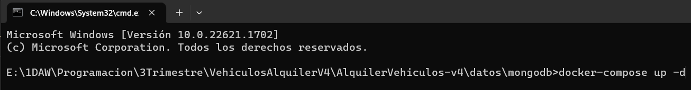
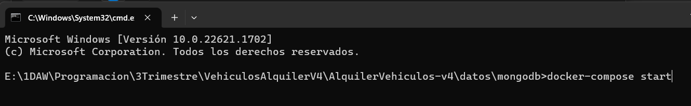

# Tarea: Alquiler de vehículos (v4)
## Profesor: José Ramón Jiménez Reyes
## Alumno: Juan Manuel García Moyano

En este sprint, a diferencia de la versión 3 se el ha añadido 2 bases de datos, un poco más adelante veremos como seleccionar o elegir cada una o si queremos que sea de forma gráfica o texto. Otro punto que considero importante que se ha añadido el que se puede generar un pdf que va a contener una tabla de los alquileres para un cliente o un vehículo.

Antes de pasar como cambiar los argumentos voy a explicar cada uno:

- **-vtexto**: vista que nos mostrará la aplicación en forma de texto.
- **-vgraficos**: vista que nos mostrará la aplicacaión de forma gráfica.
- **-fdficheros**: leer y escribir los datos se harán desde un fichero .xml.
- **-fdmariadb**: leer y escribir los datos desde una base de datos sql.
- **-fdmongodb**: leer y escribir los datos desde una base de datos no sql.

Las herramientas que se necesitan para la aplicación son opcionales, pero necesarias para usar algunas de las funciones:
- **Docker**: necesario si queremos utilizar ambas bases de datos para levantar los contenedores.
- **Compass**: si queremos ver los datos que tenemos almacenados en la BD de MongoDB.
- **DBeader**: si queremos ver los datos que tenemos almacenados en la BD de MariaDB.

Para elegir las **Factoria de Vista** tenemos dos opciones:

1. Forma gráfica, que para elegir cada una de las factorias vamos a tener que cambiar los argumentos como en la siquiente imagen (el IDE que uso es eclipse): 

2. Desde el CMD (o donde prefieras): de esta forma vamos a abrir el CMD (en mi caso).

    - Nos vamos a meter en la ruta del proyecto en el explorador de archivos y vamos a escribir cmd.

	- Cuando se abra el CMD desde la ruta escribimos: `java -jar build\libs\AlquilerVehiculos-v4.jar -vgraficos -fdmongodb`.

En el comando anterior le pasamos como parámetros `-vgraficos` y `-fdmongodb`, aquí podemos pasarle cualquiera de los anteriormente dichos, puedes pasarle dos, uno o ninguno porque por defecto tiene la vista gráfica y MongoDB.
	

Para utilizar las bases de datos tenemos que levantar los contenedores, lo voy a hacer con MongoDB pero con MariaDB se hace igual.

1. Nos vamos a la carpeta de la aplicación, nos metemos en datos, en la carpeta de mongodb y ponemos cmd.

2. Para levantarlo ejecutamos el siguiente comando: `docker-compose up -d` y cuando termine ponemos `docker-compose start`.

¡¡¡Ahora a toquetear todo lo que se pueda y a probar!!!

